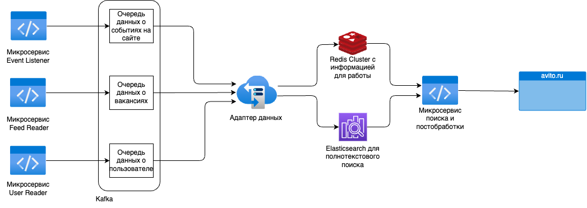

# МАИ, школа МАтМода и IT 2023, кейс от компании Avito

## Проблемы, которые решает наш продукт

- Нерелевантная выдача вакансий для соискателей
- Пользователи совершают ошибки при вводе запроса
- Выдача вакансий не персонализирована (не опирается на профиль пользователя)
- Неинформативный формат карточки вакансии
- "Пустые" пользователи (не заполнили профиль)

## Как мы решаем эти проблемы

- Персонализированная выдача вакансий на основании (профиля пользователя, резюме пользователя, истории поиска, истории просмотров, истории откликов)
- Редизайн карточки вакансии
- Добавление первоначального опроса пользователя для заполнения профиля
- Подбор вакансий по профилю пользователя
- Поиск похожих вакансий
- Поиск с учетом ошибок в запросе

## Какие технологии мы используем

- Golang
- Redis
- ElasticSearch
- Kafka
- Docker
- Html, Css, Js

## Полезные ссылки

- Анализ рынка: https://docs.google.com/spreadsheets/d/1o7nhdoCt2CpIixmBxUgdp0EkvkGBAsRmfUTqxc_WtIY/edit?usp=sharing
- Информация и функциональность по страницам фронта: https://docs.google.com/document/d/1KH5t4QEh0by9TRm2EkwhJ00liOrt8FNllUKZFxzu9Mg/edit?usp=sharing

## Как запустить проект

- TODO....

## Архитектура проекта

